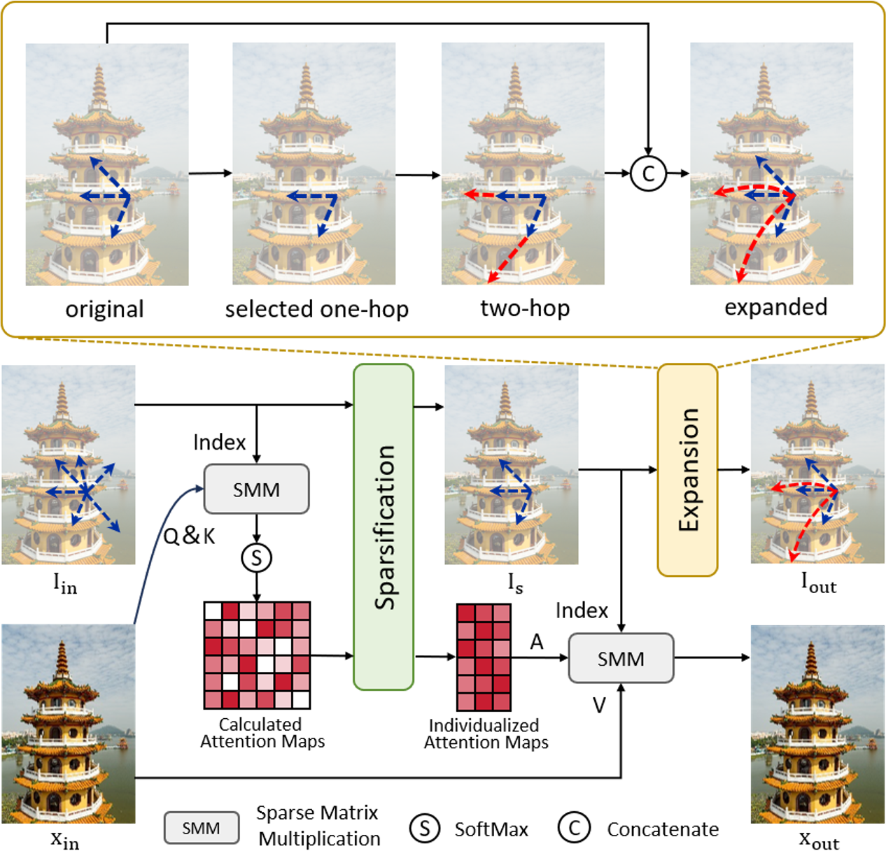

  <h1 align="center">From Local Windows to Adaptive Candidates via Individualized Exploratory: Rethinking Attention for Image Super-Resolution</h1>
  

    <a href="https://openreview.net/profile?id=%7EChunyu_Meng5">Chunyu Meng</a>
    ·
    <a href="https://scholar.google.com/citations?user=CsVTBJoAAAAJ&hl=zh-CN">Wei Long</a>
    ·
    <a href="https://scholar.google.com/citations?user=-kSTt40AAAAJ&hl=zh-CN">Shuhang Gu</a>
  

[//]: # (  <h3 align="center">CVPR 2025</h3>)

[//]: # (  <h3 align="center">)
[//]: # (  </h3>)

## Abstract

Single Image Super-Resolution (SISR) is a fundamental computer vision task that aims to reconstruct a high-resolution (HR) image from a low-resolution (LR) input. Transformer-based methods have achieved remarkable performance by modeling long-range dependencies in degraded images. However, their feature-intensive attention computation incurs high computational cost. To improve efficiency, most existing approaches partition images into fixed groups and restrict attention within each group. Such group-wise attention overlooks the inherent asymmetry in token similarities, thereby failing to enable flexible and token-adaptive attention computation. To address this limitation, we propose the Individualized Exploratory Transformer (IET), which introduces a novel Individualized Exploratory Attention (IEA) mechanism that allows each token to adaptively select its own content-aware and independent attention candidates. This token-adaptive and asymmetric design enables more precise information aggregation while maintaining computational efficiency. Extensive experiments on standard SR benchmarks demonstrate that IET achieves state-of-the-art performance under comparable computational complexity.

  

The complete training and inference code, along with the pretrained model for IET, will be released soon.
